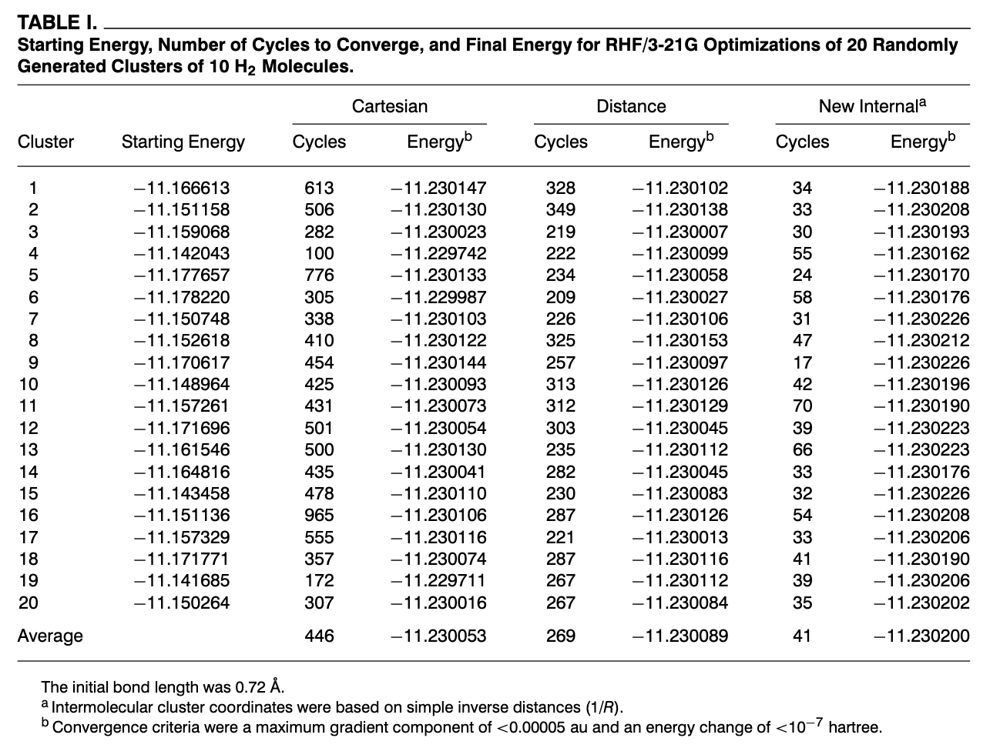
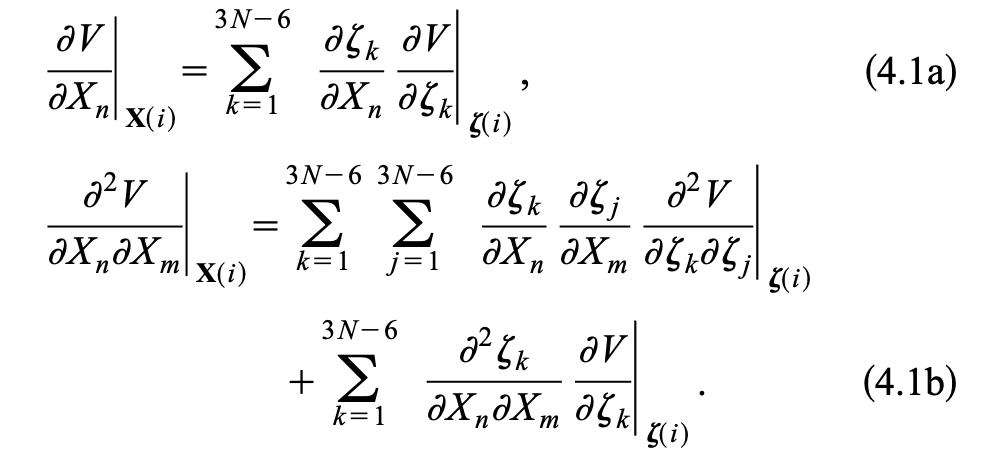
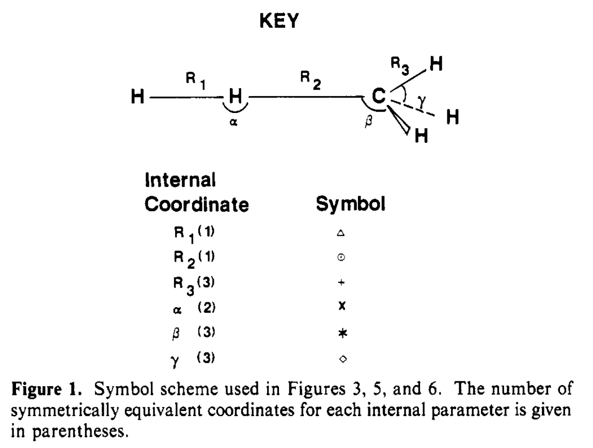
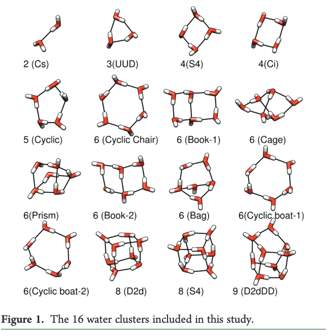
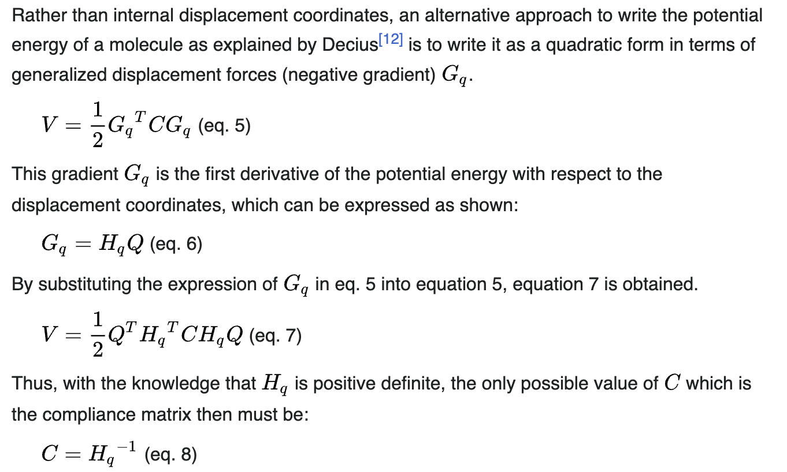

# Zusammenfassung Literaturrecherche Nomodecopaper

Abkürzungen:

+ NMA (Normal Mode Analysis)
+ MWC (Mass weighted cartesian coordnates)

##### Redundant internal coordinates, compliance constants and non-bonded interactions – some new insights

MOUMITA MAJUMDER and SADASIVAM MANOGARAN 

https://doi.org/10.1007/s12039-012-0357-7

> Identifying internal coordinates when only cartesian cordinates, masses and force constants are given. 

NMA in MWC --> normal modes tell us ICs that are needed --> chosen properly **minimum mixing**.

**Results:**

Stretching relaxed force constantes of bonds are suitable to characterize the bond order of hydrogen bond

##### Optimization of Strong and Weak Coordinates

MARCEL SWART, F. MATTHIAS BICKELHAUPT

https://doi.org/10.1002/qua.21049

> Geometry Optimization of equilibrium and transition state structures for strong and weak coordinates, screening function to differentiate strong and weak coordinates

Choice of primitives ICs to generate natural ICs is a matter of "hand work

Using delocalized coordinates approach by Baker

$\Delta q = w_p B \Delta x$, $w_p$ diagonal matrix with weight function for primitive IC

Diagonalization of $G = B_p B_p^T$

Gives $G(UR) = UR\begin{pmatrix} \Lambda \ 0 \\
0 \ 0 \end{pmatrix}$

Transform B matix in delocalized space $B_d = U^TB_d$ 

> Delocalized coordinates work well for strong coordinates, not designed for weak intermolecular coordinates

**Degree of covalance (used in Nomodeco)**

$p_{ij} = \exp[-(r_{ij}/C_{ij})-1]$ 

+ $r_{ij}$ distance
+ $C_{ij}$ sum of covalent radi
+ around one for atoms covalently bonded, lower for weaker coordinates

**Results**

Geometry optimization in delocalized internals using weak and strong coordinates.

##### The efficient optimization of molecular geometries using redundant internal coordinates

Vebjørn Bakken and Trygve Helgaker

DOI: 10.1063/1.1515483

> Optimization of molecular geometries is discussed. Extra-redundant internal coordinates reduce the number of geometry steps, complete expressions for first and second derivatives of B matrix are presented

+ Covalent bonds as well as hydrogen bonds are used

Transformation between cartesian and redundant

Gradient and hessian:

+ $g_x = B^tg_q$
+ $H_x = B^t H_q B + K$

where K is

$K_{jk} = \sum_{i}[g_q]_i B'_{ijk}$

Applying generalized inverse one can to the back transformation

+ $g_q = (B^t)^+ g_x$
+ $H_q = (B^t)^+(H_x - K)B^+$

**Results**

Minimization extra-redundant systems should be used optimization is efficiently carried out.

##### The Choice of Internal Coordinates in Complex Chemical Systems

KÁROLY NÉMETH, MATT CHALLACOMBE, MICHEL VAN VEENENDAAL

https://doi.org/10.1002/jcc.21494

> Article talks about appropiate choice in internal coordinates in complex chmical systems.

>"Blackbox recognition of internal coordinates is fundamental for the extension of internal coordinate algorithms"

G Matrix connects B matrix with its pseudoinverse:

$G_c = B^T B$, $A = G_c^{-1}B^T$

G matrix has $N_f = 3N-6(5)$ nonzero eigenvalues, six zero eigenvalues for translations and rotations

**Alternative Coordinate Selection Algorithms (Maybe to test in the future)**

Selection based on Condition number of $G_c$.

1. Calculate $\lambda_{max}$ and $\lambda_{min}$
2. Let $\lambda_c = |\lambda_{max}|/|\lambda_{min}|$
3. Condition number tells us how "pertubation" affects equation $Ax =b$ 
4. If condition number near 1 "well conditioned"
5. ICs give homogeneous description of space

Selection based on Cholesky Factorization of $G_c$?

Conectivity analysis --> **The von Arnim-Ahlrichs Approach**

**Results**

> New selection algorithms for ICs are presented wich recognize the coordinates for topologically complex systems. 

##### Efficient Geometry Optimization of Molecular Clusters
JON BAKER, PETER PULAY

https://doi.org/10.1002/(SICI)1096-987X(20000115)21:1

> Using valence coordinates (stretches, bends, and torsions) to describe intramolecular degrees of freedom with inverse distance coordinates for intermolecular degrees of freedom, efficient set of coordinates can be derived for geom opt of molecular clusters.

"The efficient optimization of the geometries of weakly bound molecular clusters is a difficult task"

Again delocalized internal ICs are used $G = BB^T$

$G(UR) = UR\begin{pmatrix} \Lambda \ 0 \\
0 \ 0 \end{pmatrix}$

The all stretches, bends, torsions are generated based on atomic connectivity and all inverse distances between atoms of different molecules in clusters

for example $(H_2O)_{10}$:

+ two $O-H$ stretches and one $\angle HOH$ bend for each molecule
+ 405 additonal inverse distances, cutoffs are used!

**Results:**

> Delocalized cluster coordinates where intermolecular bonding are represented with inverse distances are efficient at optimizing geometries of weakly bound molecular clusters

##### Polyatomic molecular potential energy surfaces by interpolation in local internal coordinates

Keiran C. Thompson ,Meredith J. T. Jordan, and Michael A. Collins

https://doi.org/10.1063/1.476259

> Method for expression of a PES for polyatomic molecules as interpolation of local Taylor expansions in internal coordinates is presented.

**Redundant coordinate problem:**

> For more than four atoms the number of bond lenghts is greated than the number of ICs $3N-6$ in any given region of the configuration space only a subset can form independent variables

All coordinates elements of vector space isomorphic to $R^m$, positions of atoms are described by $R^3$, set of all positions is $R^{3N}$ mapping which constructs $N(N-1)/2$ bonds from $3N$ positions is non linear no vector space but a **Riemannian manifold** 

The Jacobian, $B$ has rank $3N-6$ there are six directions in $R^{3N}$ which cannot be described using bond lengths

Expansion Potential energy using ICs, Problem numericall instability for example if a near planar configuration is seen.

##### Intrinsic Frequency Analysis of the Generalized Normal-Mode Vibrations for the Reaction H2 + CH3 —> H + CH4

Jerry A. Boatz and Mark S. Gordon

https://doi.org/10.1021/j100352a025

> Vibrational energy distributions and intrinsic frequencies are computed at selected points along the $H_2 + CH_3 \to H + CH_4$ intrinsic reaction coordinate at UHF/STO-3G level. Intrinsic frequencies provide evolution of generalized normal coordinates along the reaction path.

$f_{ij} = \partial^2 E / \partial x_i \partial x_j$ in cartesian

$F_{ij} = \partial^2 E / \partial r_i \partial r_j$ in internals

Diagonalization of $f$ matrix

$\Lambda = l^t f l = D^t F D$ with $D = BI$

Vibrational density matrix

$P_{mn}^i = D_{mi}F_{mn}D_{ni}/\lambda_i$ 

Energy distribution matrix is obtained from $P^i$ and gives fractional contribution of IC $r_m$ to generalized normal coordinate

Intrinsic frequencies

$v_n = \sum_m \sum_i P_{mn}^i \lambda_i$

$v_n$ represents total contribution of internal coordinate $r_n$ to the normal-coodrinate frequencies. Is the frequency associated with the single motion of a internal coordinate $r_n$ 

##### The Role of Anharmonicity in Hydrogen-Bonded Systems: The Case of Water Clusters

Berhane Temelso and George C. Shields
https://doi.org/10.1021/ct2003308

> Nature of vibrational anharmonicity has been exained for small water clusters using second order vibrational pertubation theory (VPT2) applied on MP2 potential energy surfaces. Intermolecular modes are substantially more anharmonic than the intramolecular modes

+ Each whater cluster has $2n$ high frequency intramolecular stretching modes
+ $n$ intramolecular bending modes
+ $6n-6$ low frequency intermolecular modes

##### The vibration-rotation problem in triatomic molecules allowing for a large-amplitude bending vibration

J.T. Hougen, P.R. Bunker, J.W.C. Johns

https://doi.org/10.1016/0022-2852(70)90080-9

> Here the expression of the vibration-rotation Hamiltonian of a triatomic molecule are derived. Rectilinear displacment coordinates are inappropiate for vibrational motion in triatomic molecules when the amplitude of the bending is large.

## Futher Theory / Stuff
**Force Constants / Relaxed force Constants**
$V = V_0 + G^T Z + \frac{1}{2}Z^T H Z + ...$ 

$Z$ ... arbitrary displacement coordinate

Harmonic Potential $V = \frac{1}{2}Z^THZ$

Transition to internal coordinates: $V = \frac{1}{2}Q^T H_q Q$

Hessian matrix $H_q 0 \frac{\partial^2 V}{\partial Q_i \partial Q_j}$ 

Relaxed force constants are inverse of diaognal C matrix element.

> While the force constant matrix F represents the rigitidy of a molecule, the compliance matrix G represents the flexibility of a molecule
